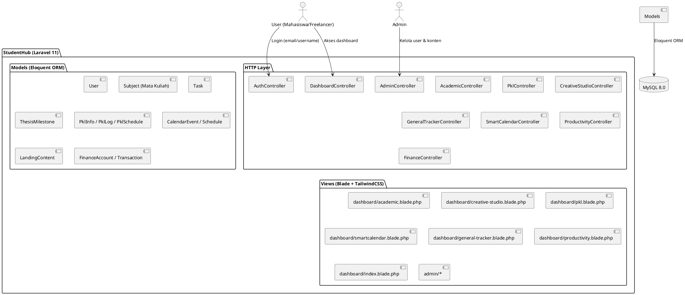

# StudentHub (SFHUB) — Platform All-in-One untuk Mahasiswa & Freelancer

<p align="center">
  
  
  
  
</p>

> **StudentHub** adalah platform manajemen produktivitas all-in-one yang dirancang khusus untuk mahasiswa Indonesia yang juga menjalani karir sebagai freelancer, magang (PKL), atau content creator. Semua aktivitas dikelola dalam satu dashboard terintegrasi yang terhubung ke database MySQL.

---

## 📖 Tentang Project

StudentHub adalah platform produktivitas all-in-one untuk mahasiswa aktif yang juga berprofesi sebagai freelancer atau sedang menjalani PKL/magang. Semua modul terhubung ke database MySQL dengan CRUD penuh.

### 🎯 Fitur Utama

| Modul | Deskripsi | URL |
|---|---|---|
| **Academic Hub** | Mata kuliah, tugas, milestone skripsi | `/dashboard/academic` |
| **Creative Studio** | Kanban proyek freelance & Shutterstock | `/dashboard/creative` |
| **PKL Manager** | Log aktivitas magang, jadwal, info perusahaan | `/dashboard/pkl` |
| **Finance Tracker** | Akun, transaksi, budget, tabungan | `/dashboard/finance` |
| **Smart Calendar** | Kalender terintegrasi + kegiatan rutin | `/dashboard/smart-calendar` |
| **General Tracker** | Task non-akademik (kesehatan, personal) | `/tracker` |
| **Focus Today** | Gantt timeline harian + Eisenhower Matrix | `/dashboard` |
| **Analytics** | Grafik produktivitas mingguan | `/dashboard/productivity` |
| **Admin Dashboard** | Kelola user & konten landing page | `/admin` |

## 🏗️ Arsitektur Sistem



### Stack Teknologi

| Layer | Teknologi |
|---|---|
| Backend | Laravel 11.x + PHP 8.2 |
| Database | MySQL 8.0 |
| Frontend | Blade Templates + TailwindCSS 3.x |
| Charts | Chart.js |
| Icons | Font Awesome 6 |
| Auth | Laravel Auth (session-based) |
| Testing | PHPUnit (Laravel Feature Tests) |

## 🚀 Instalasi & Setup Development

### Prerequisites
- PHP 8.2+, Composer
- MySQL 8.0+ atau MariaDB 10.3+
- Node.js 18+ & NPM
- Git

### Langkah Instalasi

```bash
# 1. Clone
git clone <repo-url> sfhub
cd sfhub

# 2. Dependencies
composer install
npm install

# 3. Environment
cp .env.example .env
php artisan key:generate

# 4. Konfigurasi .env
#    DB_DATABASE=sfhub_db
#    DB_USERNAME=root
#    DB_PASSWORD=

# 5. Migrasi & Seed demo data
php artisan migrate
php artisan db:seed

# 6. Build assets
npm run build
# atau mode dev:
npm run dev

# 7. Jalankan server
php artisan serve
```

**Akun Demo setelah seeding:**
| Akun | Email | Username | Password | Role |
|---|---|---|---|---|
| Admin | `admin@sfhub.dev` | `admin` | `password` | admin |
| Demo User | `demo@sfhub.dev` | `budimhs` | `password` | both |

---

## 🗄️ Struktur Database (Tabel Utama)

| Tabel | Deskripsi |
|---|---|
| `users` | Pengguna (username, email, role, is_active) |
| `subjects` | Mata kuliah (code, name, sks, day_of_week, progress, drive_link) |
| `tasks` | Semua tugas (academic, Creative, PKL, personal) |
| `thesis_milestones` | Milestone skripsi per user |
| `pkl_infos` | Info PKL/magang per user |
| `pkl_logs` | Log aktivitas harian PKL |
| `pkl_schedules` | Jadwal mingguan PKL |
| `schedules` | Jadwal rutin harian (untuk Gantt & SmartCalendar) |
| `calendar_events` | Event one-off di kalender |
| `finance_accounts` | Akun keuangan |
| `transactions` | Transaksi keuangan |
| `budgets` | Budget per kategori |
| `debts` | Hutang/piutang |
| `assets` | Aset fisik |
| `investment_instruments` | Instrumen investasi |
| `landing_contents` | Konten landing page (dikelola admin) |
| `productivity_logs` | Log produktivitas harian |

## 📁 Struktur Project

```
SFHUB/
├── app/
│   ├── Http/
│   │   ├── Controllers/
│   │   │   ├── AcademicController.php       # CRUD mata kuliah, tugas, milestone
│   │   │   ├── AdminController.php          # Admin: user + landing content
│   │   │   ├── AuthController.php           # Login (email/username), register
│   │   │   ├── CreativeStudioController.php # CRUD proyek kreatif
│   │   │   ├── DashboardController.php      # Focus, Academic, PKL, Productivity
│   │   │   ├── FinanceController.php        # Keuangan lengkap
│   │   │   ├── GeneralTrackerController.php # CRUD tugas personal
│   │   │   ├── PklController.php            # CRUD PKL info, jadwal, aktivitas
│   │   │   ├── ProductivityController.php   # Analytics produktivitas
│   │   │   └── SmartCalendarController.php  # Kalender + kegiatan rutin
│   │   └── Middleware/
│   │       └── AdminMiddleware.php          # Guard route admin
│   └── Models/
│       ├── User.php (+ username, is_active)
│       ├── Subject.php (+ progress, drive_link, notes)
│       ├── Task.php (+ task_type, notes, deadline, drive_link)
│       ├── ThesisMilestone.php          # Milestone skripsi
│       ├── PklInfo.php                  # Info perusahaan PKL
│       ├── PklSchedule.php              # Jadwal mingguan PKL
│       ├── PklLog.php (+ task, category, hours, status)
│       └── LandingContent.php           # Konten landing page
├── database/
│   ├── migrations/                    # 30+ migration files
│   └── seeders/
│       ├── DatabaseSeeder.php
│       ├── UserSeeder.php               # Admin + demo user
│       ├── LandingContentSeeder.php     # Fitur & stats landing page
│       ├── SubjectSeeder.php            # 4 mata kuliah demo
│       ├── TaskSeeder.php               # Tasks: academic, creative, personal
│       ├── ThesisMilestoneSeeder.php    # 5 milestone skripsi
│       ├── PklSeeder.php                # Info PKL, jadwal, 7 aktivitas
│       ├── ScheduleSeeder.php           # Jadwal harian rutin
│       └── CalendarEventSeeder.php      # Event kalender bulan ini
├── resources/views/
│   ├── dashboard/
│   │   ├── academic.blade.php           # Academic Hub (terhubung DB)
│   │   ├── creative-studio.blade.php    # Creative Studio Kanban
│   │   ├── general-tracker.blade.php    # General Tracker
│   │   ├── index.blade.php              # Focus Today + Gantt
│   │   ├── pkl.blade.php                # PKL Manager
│   │   ├── productivity.blade.php       # Analytics
│   │   └── smartcalendar.blade.php      # Smart Calendar
│   └── admin/
│       ├── index.blade.php              # Admin dashboard
│       ├── users.blade.php              # Manajemen user
│       ├── create-user.blade.php        # Form tambah user
│       └── landing.blade.php            # Konten landing page
├── routes/web.php                     # Semua routes CRUD
└── tests/Feature/
    ├── AcademicCRUDTest.php
    ├── PklCRUDTest.php
    ├── AuthLoginTest.php
    ├── CreativeStudioTest.php
    ├── GeneralTrackerTest.php
    └── AdminTest.php
```

## 🧪 Testing

### Menjalankan Tests
```bash
# Jalankan semua test
php artisan test

# Jalankan file test tertentu
php artisan test tests/Feature/AcademicCRUDTest.php
php artisan test tests/Feature/PklCRUDTest.php
php artisan test tests/Feature/AuthLoginTest.php
php artisan test tests/Feature/AdminTest.php

# Dengan coverage report
php artisan test --coverage
```

### Test Cases (UAT)

| Test Class | Skenario yang Diuji |
|---|---|
| `AcademicCRUDTest` | Buat/edit/hapus mata kuliah, buat/toggle/hapus tugas, buat/update milestone skripsi, akses tanpa auth |
| `PklCRUDTest` | Buat info PKL, update info, buat/update/hapus aktivitas harian, update jadwal, proteksi data user lain |
| `AuthLoginTest` | Login dengan email, login dengan username, login gagal (password salah), user nonaktif tidak bisa login, register auto-generate username |
| `CreativeStudioTest` | Buat proyek, update status, hapus proyek, verifikasi grouping per stage |
| `GeneralTrackerTest` | Buat task, toggle status, hapus task, variabel view, proteksi data user lain |
| `AdminTest` | Admin bisa akses, non-admin diblokir, kelola user (buat/toggle aktif/hapus), kelola landing content |

## 📊 Daftar Route / API Endpoints

### Autentikasi
| Method | URL | Aksi |
|---|---|---|
| `POST` | `/login` | Login dengan email **atau** username |
| `POST` | `/register` | Daftar akun baru |
| `POST` | `/logout` | Logout |

### Academic
| Method | URL | Nama Route |
|---|---|---|
| `GET` | `/dashboard/academic` | `dashboard.academic` |
| `POST` | `/academic/courses` | `academic.courses.store` |
| `PUT` | `/academic/courses/{id}` | `academic.courses.update` |
| `DELETE` | `/academic/courses/{id}` | `academic.courses.destroy` |
| `POST` | `/academic/tasks` | `academic.tasks.store` |
| `POST` | `/academic/tasks/{id}/status` | `academic.tasks.status` |
| `DELETE` | `/academic/tasks/{id}` | `academic.tasks.destroy` |
| `POST` | `/academic/milestones` | `academic.milestones.store` |
| `PUT` | `/academic/milestones/{id}` | `academic.milestones.update` |

### PKL Manager
| Method | URL | Nama Route |
|---|---|---|
| `GET` | `/dashboard/pkl` | `dashboard.pkl` |
| `POST` | `/pkl/info` | `pkl.info.store` |
| `PUT` | `/pkl/info/{id}` | `pkl.info.update` |
| `POST` | `/pkl/schedule` | `pkl.schedule.update` |
| `POST` | `/pkl/activities` | `pkl.activities.store` |
| `PUT` | `/pkl/activities/{id}` | `pkl.activities.update` |
| `DELETE` | `/pkl/activities/{id}` | `pkl.activities.destroy` |

### Creative Studio
| Method | URL | Nama Route |
|---|---|---|
| `GET` | `/dashboard/creative` | `dashboard.creative` |
| `POST` | `/dashboard/creative` | `dashboard.creative.store` |
| `PUT` | `/dashboard/creative/{id}` | `dashboard.creative.update` |
| `DELETE` | `/dashboard/creative/{id}` | `dashboard.creative.destroy` |

### Admin
| Method | URL | Nama Route |
|---|---|---|
| `GET` | `/admin` | `admin.index` |
| `GET` | `/admin/users` | `admin.users` |
| `POST` | `/admin/users` | `admin.users.store` |
| `POST` | `/admin/users/{user}/toggle-active` | `admin.users.toggle` |
| `DELETE` | `/admin/users/{user}` | `admin.users.destroy` |
| `GET` | `/admin/landing` | `admin.landing` |
| `POST` | `/admin/landing` | `admin.landing.store` |
| `PATCH` | `/admin/landing/{content}` | `admin.landing.update` |
| `DELETE` | `/admin/landing/{content}` | `admin.landing.destroy` |

## 🔧 Konfigurasi

### Environment Variables (.env)
```env
APP_NAME="StudentHub"
APP_ENV=local
APP_DEBUG=true
APP_URL=http://localhost:8000

DB_CONNECTION=mysql
DB_HOST=127.0.0.1
DB_PORT=3306
DB_DATABASE=sfhub_db
DB_USERNAME=root
DB_PASSWORD=

SESSION_DRIVER=database
CACHE_STORE=file
```

## 🚀 Panduan Deploy ke Produksi

```bash
# 1. Clone & install
git clone <repo> && cd sfhub
composer install --no-dev --optimize-autoloader
npm install && npm run build

# 2. Setup environment
cp .env.example .env
php artisan key:generate
# Edit .env: APP_ENV=production, APP_DEBUG=false, DB_*, APP_URL

# 3. Migrasi & seed
php artisan migrate --force
php artisan db:seed --force

# 4. Optimize
php artisan config:cache
php artisan route:cache
php artisan view:cache

# 5. Permission (Linux)
chmod -R 775 storage bootstrap/cache
chown -R www-data:www-data storage bootstrap/cache

# 6. Web server
# Arahkan document root ke folder /public
# Pastikan mod_rewrite (Apache) atau try_files (Nginx) aktif
```

**Nginx config minimal:**
```nginx
location / {
    try_files $uri $uri/ /index.php?$query_string;
}
```

## 📚 Panduan Pengguna (User Manual)

### Untuk User Biasa

**1. Login / Register**
- Buka halaman utama → klik "Daftar Gratis" atau "Masuk"
- Bisa login dengan **email** atau **username**

**2. Academic Hub** (`/dashboard/academic`)
- Klik **"+ Mata Kuliah"** untuk menambah matkul baru
- Klik **"+ Tugas"** untuk menambah tugas/assignment
- Tab **Skripsi** untuk kelola milestone skripsi
- Klik ikon centang pada tugas untuk toggle selesai/belum

**3. PKL Manager** (`/dashboard/pkl`)
- Klik gear ⚙️ untuk mengisi info perusahaan PKL
- Tab **Log Aktivitas** → **"Log Hari Ini"** untuk mencatat aktivitas
- Tab **Jadwal** → edit untuk mengatur jadwal mingguan

**4. Creative Studio** (`/dashboard/creative`)
- Klik **"Proyek Baru"** untuk membuat proyek kreatif
- Drag proyek ke kolom berbeda untuk ubah stage (atau edit manual)
- Klik kartu proyek untuk lihat detail

**5. Smart Calendar** (`/dashboard/smart-calendar`)
- Klik **"+ Event"** untuk event one-off
- Klik **"Kegiatan Rutin"** untuk jadwal berulang
- Navigasi bulan dengan tombol ← / →

**6. General Tracker** (`/tracker`)
- Tambah task cepat via kolom "Tambah Cepat" di sidebar
- Filter task: Semua / Belum / Selesai / Hari Ini

### Untuk Admin (`/admin`)

**1. Manajemen User**
- `/admin/users` → lihat semua user
- Klik **"Nonaktifkan"** untuk menonaktifkan user (user tidak bisa login)
- Klik **"Aktifkan"** untuk mengaktifkan kembali
- Klik **"+ Tambah User"** untuk menambah user baru

**2. Konten Landing Page**
- `/admin/landing` → kelola konten fitur & stats
- Klik **"Tambah Konten"** untuk menambah item baru
- Klik **"Nonaktifkan/Aktifkan"** untuk toggle tampil/tidak di halaman utama
- Konten tampil otomatis di `home.blade.php` berdasarkan `section` (features, stats, dll)

## 📝 Changelog

### v2.0.0 (2026-03)
- ✅ 7 dashboard blade views terhubung penuh ke database MySQL
- ✅ CRUD Academic Hub (mata kuliah, tugas, milestone skripsi)
- ✅ CRUD PKL Manager (info perusahaan, jadwal, log aktivitas)
- ✅ CRUD Creative Studio (Kanban projects)
- ✅ CRUD General Tracker (personal tasks)
- ✅ Smart Calendar dari data DB
- ✅ Analytics Produktivitas dari data DB
- ✅ Login dengan email **atau** username
- ✅ Admin Dashboard (kelola user + landing content)
- ✅ Home page dinamis dengan LandingContent dari DB
- ✅ Database seeders dengan data demo realistis
- ✅ 6 Feature Test classes (AcademicCRUD, PklCRUD, Auth, Creative, GeneralTracker, Admin)

### v1.0.0
- ✅ Finance, Asset, Debt, Investment management
- ✅ Dashboard charts (Chart.js)
- ✅ Dark mode + Indonesian localization

## 🐛 Troubleshooting

### Common Issues

**1. Migration Error**
```bash
php artisan migrate:fresh --seed
```

**2. Asset Compilation**
```bash
npm run build
# atau
npm run dev
```

**3. Permission Issues**
```bash
chmod -R 775 storage bootstrap/cache
```

**4. Cache Clear**
```bash
php artisan cache:clear
php artisan config:clear
php artisan route:clear
php artisan view:clear
```

## 📄 License

This project is licensed under the MIT License - see the [LICENSE](LICENSE) file for details.

## 🙏 Acknowledgments

- [Laravel](https://laravel.com) - The PHP Framework For Web Artisans
- [TailwindCSS](https://tailwindcss.com) - Utility-first CSS framework
- [Chart.js](https://www.chartjs.org) - Simple yet flexible JavaScript charting
- [Font Awesome](https://fontawesome.com) - The internet's icon library

## 📞 Support

- 📧 Email: support@sfhub.com
- 📱 WhatsApp: +62 812-3456-7890
- 🐛 Issues: [GitHub Issues](https://github.com/username/SFHUB/issues)
- 📖 Documentation: [Wiki](https://github.com/username/SFHUB/wiki)

---

<p align="center">
  Made with ❤️ for Indonesian Students
</p>
